# aws_iot_sensor_hub
MQTT client to AWS IOT

## 概要
センサー情報などをAWS IOT経由でアップロードするためのMQTT Client

## mqtt_client_pal
[TWELITE PAL](https://mono-wireless.com/jp/products/twelite-pal/index.html)のセンシング結果(温度、湿度、照度）をアップロード

Raspberry Piなどに[MONOSTICK](https://mono-wireless.com/jp/products/MoNoStick/index.html)が接続された状態を想定

## 構成図


### 実行例

```jsx
$ python3 mqtt_client_pal.py 
  *** Open /dev/ttyUSB0 ***
sensor/palamb0001/sensor_update {'device_name': 'palamb0001', 'type': 'Envsensor', 'timestamp': 1647137205, 'temperature': 20.03, 'humidity': 68.02, 'illuminance': 0, 'power': 2520}
```

### 認証情報
config.pyに記載している認証情報のファイルは
cert/ディレクトリ以下に配置する

```python
    ENDPOINT = 'aaaaaaaa.iot.ap-northeast-1.amazonaws.com'
    PORT = 9999
    ROOTCA = 'cert/AmazonRootCA1.pem'
    CERT = 'cert/certificate.pem.crt'
    PRIVATEKEY = 'cert/private.pem.key'
```

certificate.pem.crtとprivate.pem.keyは認証情報がファイル名に含まれるためシンボリックリンクを貼る

```
#例
$ ln -s xxxxxxxxxxx-certificate.pem.crt certificate.pem.crt
```

endpoitのパスとPORTもAWS IOT側に合わせて適宜修正すること

```python
    ENDPOINT = 'aaaaaaaa.iot.ap-northeast-1.amazonaws.com'
    PORT = 9999
```